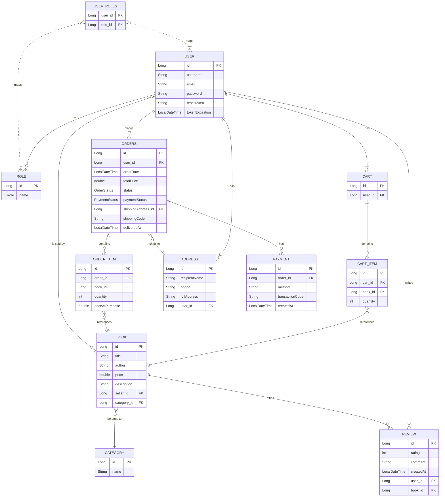

# Bookstore API - Spring Boot Project


Một hệ thống backend RESTful API hoàn chỉnh cho ứng dụng bán sách trực tuyến, được xây dựng bằng Spring Boot. Dự án này hỗ trợ đầy đủ các chức năng cho ba vai trò người dùng: Khách hàng (USER), Người bán (SELLER), và Quản trị viên (ADMIN).

---

## Mục lục
- [Tính năng chính](#tính-năng-chính)
- [Công nghệ sử dụng](#công-nghệ-sử-dụng)
- [Luồng nghiệp vụ](#luồng-nghiệp-vụ)
- [Sơ đồ Database (Mermaid)](#sơ-đồ-database-mermaid)
- [Thiết lập và Cài đặt](#thiết-lập-và-cài-đặt)
- [Cấu hình môi trường](#cấu-hình-môi-trường)
- [Cấu trúc dự án](#cấu-trúc-dự-án)
- [Tổng quan API Endpoints](#tổng-quan-api-endpoints)
- [English Version](#-english-version)

---

## Tính năng chính

### 1. **Quản lý Xác thực & Phân quyền (Authentication & Authorization)**
-   **Đăng ký/Đăng nhập:** Hệ thống xác thực dựa trên JWT (JSON Web Tokens).
-   **Phân quyền theo vai trò:**
    -   **USER:** Quản lý giỏ hàng, đặt hàng, quản lý địa chỉ, đánh giá sản phẩm đã mua.
    -   **SELLER:** Quản lý sách của mình (CRUD), quản lý danh mục, xử lý đơn hàng, xem thống kê doanh thu cá nhân.
    -   **ADMIN:** Quản lý toàn bộ người dùng (phân quyền, xóa), xem thống kê toàn hệ thống.
-   **Quên mật khẩu:** Chức năng reset mật khẩu qua email bằng mã OTP.

### 2. **Quản lý Sản phẩm (Sách)**
-   CRUD đầy đủ cho sách (chỉ SELLER có quyền trên sách của mình).
-   Phân loại sách theo danh mục.
-   API public để xem danh sách và chi tiết sách.

### 3. **Trải nghiệm Mua sắm**
-   **Giỏ hàng:** Thêm, xóa, cập nhật số lượng sản phẩm trong giỏ.
-   **Đặt hàng:** Luồng đặt hàng từ giỏ hàng, tạo đơn hàng với trạng thái `PENDING`.
-   **Quản lý địa chỉ:** Người dùng có thể lưu nhiều địa chỉ và chọn khi đặt hàng.

### 4. **Xử lý Đơn hàng & Thanh toán**
-   **Luồng trạng thái đơn hàng:** `PENDING` → `CONFIRMED` → `SHIPPING` → `DELIVERED` / `CANCELLED`.
-   **Thanh toán (Mock):** Hệ thống giả lập thanh toán, chuyển trạng thái đơn hàng thành `PAID`.
-   **Vận chuyển:** Seller có thể xác nhận vận chuyển và đánh dấu đã giao hàng.

### 5. **Hệ thống Đánh giá (Review)**
-   Người dùng chỉ có thể đánh giá sách sau khi đã mua và đơn hàng được giao thành công (`DELIVERED`).
-   Hệ thống rating 1-5 sao và bình luận.

### 6. **Thống kê & Báo cáo**
-   Seller và Admin có thể xem thống kê doanh thu, số lượng đơn hàng, sản phẩm bán ra.
-   Hỗ trợ lọc theo khoảng thời gian và trạng thái đơn hàng.

### 7. **Thông báo qua Email**
-   Gửi email tự động khi:
    -   Xác nhận đơn hàng.
    -   Gửi mã OTP để reset mật khẩu.

---

## Công nghệ sử dụng

-   **Backend:** Spring Boot 3.5.3
-   **Ngôn ngữ:** Java 17
-   **Database:** MySQL
-   **ORM:** Spring Data JPA (Hibernate)
-   **Bảo mật:** Spring Security, JSON Web Tokens (JWT)
-   **Build Tool:** Maven
-   **Email:** Spring Boot Mail (Gmail SMTP)
-   **Testing:** JUnit 5, Testcontainers

---

## Luồng nghiệp vụ

1.  **Đăng ký:** Người dùng đăng ký tài khoản (mặc định là `ROLE_USER`). Admin có thể tạo tài khoản `SELLER`.
2.  **Đăng nhập:** Nhận về JWT token để sử dụng cho các request cần xác thực.
3.  **Mua sắm:**
    -   Người dùng duyệt sách (public).
    -   Thêm sách vào giỏ hàng.
    -   Xem giỏ hàng và tiến hành đặt hàng.
4.  **Thanh toán & Giao hàng:**
    -   Người dùng chọn địa chỉ giao hàng cho đơn hàng.
    -   Thực hiện thanh toán (mock). Trạng thái thanh toán của đơn hàng chuyển thành `PAID`.
    -   Seller nhận đơn, xác nhận (`CONFIRMED`).
    -   Seller chuẩn bị hàng và giao đi (`SHIPPING`), hệ thống tạo mã vận đơn.
    -   Seller xác nhận đã giao thành công (`DELIVERED`).
5.  **Đánh giá:** Sau khi đơn hàng `DELIVERED`, người dùng có thể viết đánh giá cho sản phẩm.

---

## Sơ đồ Database (Mermaid)


---

## Thiết lập và Cài đặt

### Yêu cầu
-   JDK 17
-   Maven 3.8+
-   MySQL Server
-   Docker (để chạy test với Testcontainers)

### Các bước chạy dự án

1.  **Clone repository:**
    ```bash
    git clone <your-repository-url>
    cd bookstore
    ```

2.  **Tạo database:**
    -   Kết nối vào MySQL server và chạy lệnh sau:
        ```sql
        CREATE DATABASE bookstore_db;
        ```

3.  **Cấu hình `application.properties`:**
    -   Mở file `src/main/resources/application.properties`.
    -   Cập nhật thông tin kết nối database và tài khoản email của bạn. (Chi tiết ở mục dưới).

4.  **Build và chạy dự án:**
    -   Sử dụng Maven Wrapper:
        ```bash
        ./mvnw spring-boot:run
        ```
    -   Server sẽ khởi động tại `http://localhost:8081`.

---

## Cấu hình môi trường

File cấu hình chính là `src/main/resources/application.properties`.

```properties
# Cấu hình Database
spring.datasource.url=jdbc:mysql://localhost:3306/bookstore_db?useSSL=false&serverTimezone=UTC
spring.datasource.username=your_mysql_username
spring.datasource.password=your_mysql_password

# Cấu hình JWT
bookstore.jwtSecret=VGhpcyBpcyBhIHNlY3JldCBrZXkgdXNlZCBmb3Igand0IHRlc3Q= # Nên thay bằng chuỗi base64 của bạn
bookstore.jwtExpirationMs=86400000 # 24 giờ

# Cấu hình Email (sử dụng Gmail App Password)
spring.mail.host=smtp.gmail.com
spring.mail.port=587
spring.mail.username=your_email@gmail.com
spring.mail.password=your_gmail_app_password
spring.mail.properties.mail.smtp.auth=true
spring.mail.properties.mail.smtp.starttls.enable=true

# Cổng server
server.port=8081
```

---

## Cấu trúc dự án

```
com.example.bookstore
├── controller/      # REST APIs
├── dto/             # Data Transfer Objects
├── entity/          # JPA Entities
├── repository/      # Spring Data JPA Repositories
├── security/        # Cấu hình Spring Security, JWT
├── service/         # Business Logic
├── DataInitializer.java # Khởi tạo dữ liệu ban đầu
└── BookstoreApplication.java # Main class
```

---

## Tổng quan API Endpoints

Một số endpoints chính (chi tiết xem trong các file Controller):

| Method | Endpoint                               | Mô tả                               | Quyền truy cập      |
| :----- | :------------------------------------- | :---------------------------------- | :------------------- |
| `POST` | `/api/auth/login`                      | Đăng nhập                           | Public               |
| `POST` | `/api/auth/register`                   | Đăng ký                             | Public               |
| `GET`  | `/api/books`                           | Lấy danh sách sách                  | Public               |
| `POST` | `/api/books/add`                       | Thêm sách mới                       | `SELLER`             |
| `POST` | `/api/cart/add`                        | Thêm vào giỏ hàng                   | `USER`               |
| `GET`  | `/api/cart`                            | Xem giỏ hàng                        | `USER`               |
| `POST` | `/api/orders/place`                    | Đặt hàng                            | `USER`               |
| `GET`  | `/api/orders/seller`                   | Xem đơn hàng (của seller)           | `SELLER`             |
| `PUT`  | `/api/orders/update-status`            | Cập nhật trạng thái đơn hàng        | `SELLER`             |
| `POST` | `/api/reviews`                         | Thêm đánh giá                       | `USER`               |
| `GET`  | `/api/admin/users`                     | Lấy danh sách người dùng            | `ADMIN`              |
| `PUT`  | `/api/admin/users/{id}/role`           | Cập nhật quyền người dùng           | `ADMIN`              |

---

# 📖 English Version

## Bookstore API - Spring Boot Project

A complete RESTful API backend for an online bookstore application, built with Spring Boot. This project provides comprehensive functionalities for three user roles: Customer (USER), Seller (SELLER), and Administrator (ADMIN).

---

## Table of Contents
- [Key Features](#key-features-1)
- [Technology Stack](#technology-stack-1)
- [Business Workflows](#business-workflows-1)
- [Database Schema (Mermaid)](#database-schema-mermaid)
- [Setup and Installation](#setup-and-installation-1)
- [Environment Configuration](#environment-configuration-1)
- [Project Structure](#project-structure-1)
- [API Endpoints Overview](#api-endpoints-overview-1)

---

## Key Features

### 1. **Authentication & Authorization Management**
-   **Registration/Login:** JWT-based authentication system.
-   **Role-Based Access Control (RBAC):**
    -   **USER:** Manages shopping cart, places orders, manages addresses, and reviews purchased products.
    -   **SELLER:** Manages their own books (CRUD), manages categories, processes orders, and views personal sales statistics.
    -   **ADMIN:** Manages all users (assigns roles, deletes users), and views system-wide statistics.
-   **Forgot Password:** Functionality to reset passwords via an OTP code sent to the user's email.

### 2. **Product (Book) Management**
-   Full CRUD operations for books (SELLERs can only manage their own books).
-   Book categorization.
-   Public APIs to view the book list and details.

### 3. **Shopping Experience**
-   **Shopping Cart:** Add, remove, and update the quantity of products in the cart.
-   **Ordering:** A seamless ordering process from the cart, creating an order with a `PENDING` status.
-   **Address Management:** Users can save multiple shipping addresses and select one during checkout.

### 4. **Order Processing & Payment**
-   **Order Status Workflow:** `PENDING` → `CONFIRMED` → `SHIPPING` → `DELIVERED` / `CANCELLED`.
-   **Payment (Mock):** A simulated payment system that updates the order's payment status to `PAID`.
-   **Shipping:** Sellers can confirm shipment and mark orders as delivered.

### 5. **Review System**
-   Users can only review a book after they have purchased it and the order has been successfully `DELIVERED`.
-   Features a 1-5 star rating system and comments.

### 6. **Statistics & Reporting**
-   Sellers and Admins can view statistics on revenue, number of orders, and products sold.
-   Supports filtering by date range and order status.

### 7. **Email Notifications**
-   Automatic emails are sent for:
    -   Order confirmation.
    -   OTP code for password reset.

---

## Technology Stack

-   **Backend:** Spring Boot 3.5.3
-   **Language:** Java 17
-   **Database:** MySQL
-   **ORM:** Spring Data JPA (Hibernate)
-   **Security:** Spring Security, JSON Web Tokens (JWT)
-   **Build Tool:** Maven
-   **Email:** Spring Boot Mail (Gmail SMTP)
-   **Testing:** JUnit 5, Testcontainers

---

## Business Workflows

1.  **Registration:** A user registers for an account (defaults to `ROLE_USER`). An Admin can create `SELLER` accounts.
2.  **Login:** The user receives a JWT token for authenticating subsequent requests.
3.  **Shopping:**
    -   The user browses books (public access).
    -   Adds books to their shopping cart.
    -   Views the cart and proceeds to place an order.
4.  **Payment & Shipping:**
    -   The user selects a shipping address for the order.
    -   Makes a (mock) payment. The order's payment status changes to `PAID`.
    -   The seller receives the order and confirms it (`CONFIRMED`).
    -   The seller prepares the items and ships them (`SHIPPING`), and a tracking code is generated.
    -   The seller confirms successful delivery (`DELIVERED`).
5.  **Review:** After the order is `DELIVERED`, the user can write a review for the product.

---

## Database Schema (Mermaid)



---

## Setup and Installation

### Prerequisites
-   JDK 17
-   Maven 3.8+
-   MySQL Server
-   Docker (for running tests with Testcontainers)

### Steps to Run the Project

1.  **Clone the repository:**
    ```bash
    git clone <your-repository-url>
    cd bookstore
    ```

2.  **Create the database:**
    -   Connect to your MySQL server and execute the following command:
        ```sql
        CREATE DATABASE bookstore_db;
        ```

3.  **Configure `application.properties`:**
    -   Open the file `src/main/resources/application.properties`.
    -   Update your database connection details and email credentials. (Details below).

4.  **Build and run the project:**
    -   Using the Maven Wrapper:
        ```bash
        ./mvnw spring-boot:run
        ```
    -   The server will start at `http://localhost:8081`.

---

## Environment Configuration

The main configuration file is `src/main/resources/application.properties`.

```properties
# Database Configuration
spring.datasource.url=jdbc:mysql://localhost:3306/bookstore_db?useSSL=false&serverTimezone=UTC
spring.datasource.username=your_mysql_username
spring.datasource.password=your_mysql_password

# JWT Configuration
bookstore.jwtSecret=VGhpcyBpcyBhIHNlY3JldCBrZXkgdXNlZCBmb3Igand0IHRlc3Q= # Should be replaced with your own base64 string
bookstore.jwtExpirationMs=86400000 # 24 hours

# Email Configuration (using Gmail App Password)
spring.mail.host=smtp.gmail.com
spring.mail.port=587
spring.mail.username=your_email@gmail.com
spring.mail.password=your_gmail_app_password
spring.mail.properties.mail.smtp.auth=true
spring.mail.properties.mail.smtp.starttls.enable=true

# Server Port
server.port=8081
```

---

## Project Structure

```
com.example.bookstore
├── controller/      # REST APIs
├── dto/             # Data Transfer Objects
├── entity/          # JPA Entities
├── repository/      # Spring Data JPA Repositories
├── security/        # Spring Security, JWT Configuration
├── service/         # Business Logic
├── DataInitializer.java # Initial data setup
└── BookstoreApplication.java # Main class
```

---

## API Endpoints Overview

A summary of key endpoints (see Controller files for full details):

| Method | Endpoint                               | Description                         | Access Rights        |
| :----- | :------------------------------------- | :---------------------------------- | :------------------- |
| `POST` | `/api/auth/login`                      | User Login                          | Public               |
| `POST` | `/api/auth/register`                   | User Registration                   | Public               |
| `GET`  | `/api/books`                           | Get list of books                   | Public               |
| `POST` | `/api/books/add`                       | Add a new book                      | `SELLER`             |
| `POST` | `/api/cart/add`                        | Add item to cart                    | `USER`               |
| `GET`  | `/api/cart`                            | View shopping cart                  | `USER`               |
| `POST` | `/api/orders/place`                    | Place an order                      | `USER`               |
| `GET`  | `/api/orders/seller`                   | View orders (for seller)            | `SELLER`             |
| `PUT`  | `/api/orders/update-status`            | Update order status                 | `SELLER`             |
| `POST` | `/api/reviews`                         | Add a review                        | `USER`               |
| `GET`  | `/api/admin/users`                     | Get list of users                   | `ADMIN`              |
| `PUT`  | `/api/admin/users/{id}/role`           | Update user role                    | `ADMIN`              |